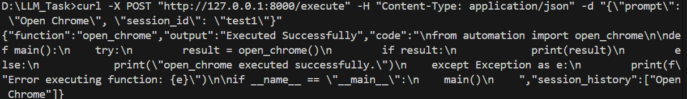
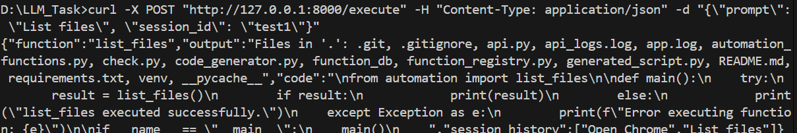
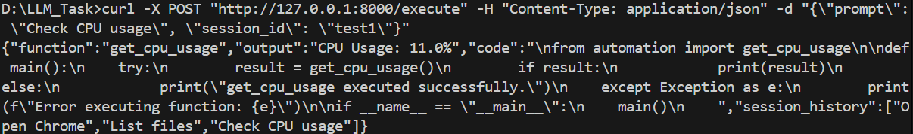
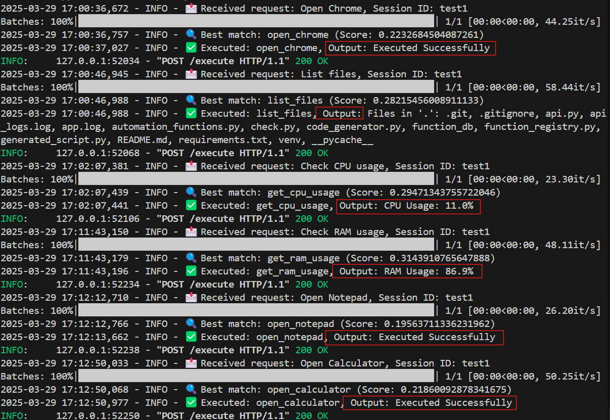

# LLM + RAG-Based Function Execution API    

## 📌 Overview
This repository contains a **Python-based API service** that dynamically retrieves and executes automation functions using **LLM + RAG (Retrieval-Augmented Generation)**. The system processes user prompts, maps them to predefined automation functions, and generates executable Python code for function invocation.

## 🛠 Features
**✅Function Registry** – Predefined automation functions, including:

    **Application Control**: Open Chrome, Calculator, Notepad, etc.
	 
    **System Monitoring**: Retrieve CPU & RAM usage.
	 
    **Command Execution**: Run shell commands.
	 
    **File Management**: List files in a directory.
	 


**✅LLM + RAG** for Function Retrieval – Uses a vector database (ChromaDB/FAISS) to map user prompts to the best-matching function.

**✅Dynamic Code Generation**– Generates Python scripts for execution based on retrieved functions.

**✅ Session-based Context** – Enhances retrieval accuracy by maintaining session memory.

**✅ API Service Implementation** – Exposes a REST API endpoint for function execution.


## 🚀 Installation & Setup
### 1️⃣ Clone the Repository
```sh
$ git clone https://github.com/your-username/AlgoRoot-automation-api.git  
$ cd AlgoRoot-automation-api  

```

### 2️⃣ Create a Virtual Environment & Install Dependencies
```sh
$ python -m venv venv
$ On Windows: venv\Scripts\activate
$ pip install -r requirements.txt
```

### 3️⃣ Run the API Server
```sh
$ uvicorn api:app --reload
```

## 📡 API Endpoints
### 🔹 Execute an Automation Function
#### **Request:**
```
curl -X POST "http://127.0.0.1:8000/execute" -H "Content-Type: application/json" -d "{\"prompt\": \"Open Chrome\", \"session_id\": \"test1\"}"


```

#### **Response:**
```json
{
  "function": "open_chrome",
  "output": "Executed Successfully",
  "code": "\nfrom automation import open_chrome\n\ndef main():\n    try:\n        result = open_chrome()\n        if result:\n            print(result)\n        else:\n            print(\"open_chrome executed successfully.\")\n    except Exception as e:\n        print(f\"Error executing function: {e}\")\n\nif __name__ == \"__main__\":\n    main()\n",
  "session_history": ["Open Chrome"]
}

```

#### **Request:**
```
curl -X POST "http://127.0.0.1:8000/execute" -H "Content-Type: application/json" -d "{\"prompt\": \"List files\", \"session_id\": \"test1\"}"


```

#### **Response:**
```json
{
  "function": "list_files",
  "output": "Files in '.': .git, .gitignore, api.py, api_logs.log, app.log, automation_functions.py, check.py, code_generator.py, function_db, function_registry.py, generated_script.py, README.md, requirements.txt, venv, __pycache__",
  "code": "\nfrom automation import list_files\n\ndef main():\n    try:\n        result = list_files()\n        if result:\n            print(result)\n        else:\n            print(\"list_files executed successfully.\")\n    except Exception as e:\n        print(f\"Error executing function: {e}\")\n\nif __name__ == \"__main__\":\n    main()\n    ",
  "session_history": ["Open Chrome","List Files"]
}

```


#### **Request:**
```
curl -X POST "http://127.0.0.1:8000/execute" -H "Content-Type: application/json" -d "{\"prompt\": \"Check CPU usage\", \"session_id\": \"test1\"}"


```

#### **Response:**
```json
{
  "function": "get_cpu_usage",
  "output": "CPU Usage: 11.0%",
  "code": "\nfrom automation import get_cpu_usage\n\ndef main():\n    try:\n        result = get_cpu_usage()\n        if result:\n            print(result)\n        else:\n            print(\"get_cpu_usage executed successfully.\")\n    except Exception as e:\n        print(f\"Error executing function: {e}\")\n\nif __name__ == \"__main__\":\n    main()\n      ",
  "session_history": ["Open Chrome","List Files","Check CPU usage"]
}

```
## 📷 Screenshots
### 1️. Opening Chrome Browser




### 2️. List files 




### 2️⃣ Check CPU Usage




### Final Results of All

